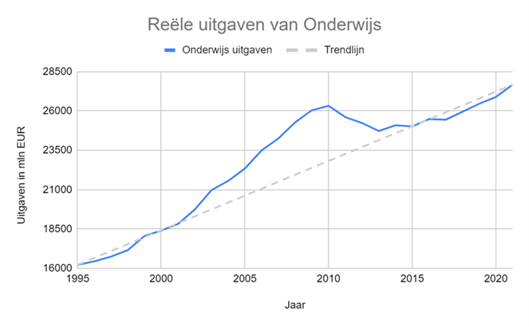
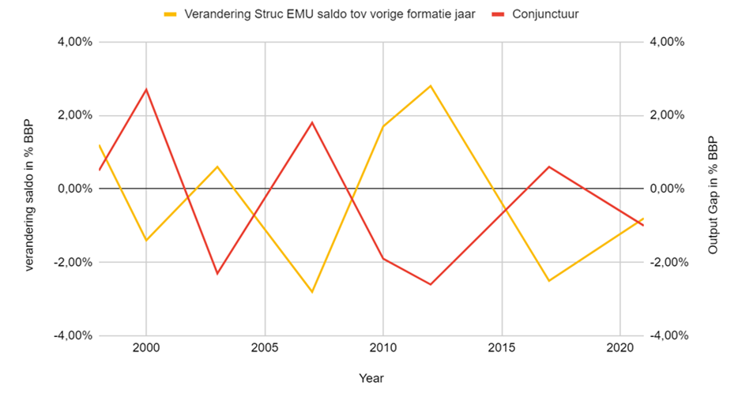
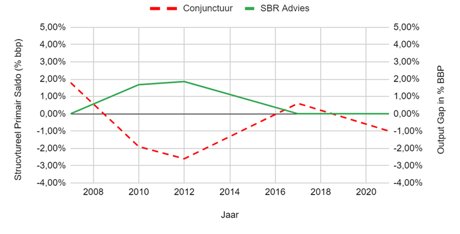
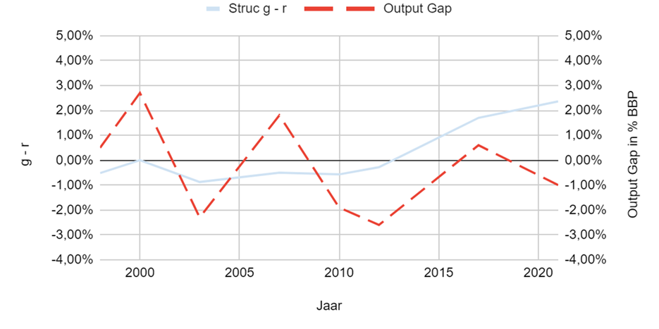
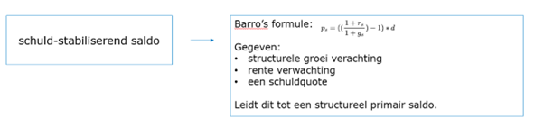
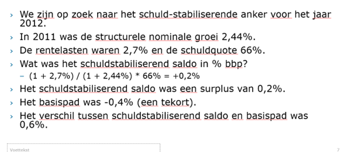
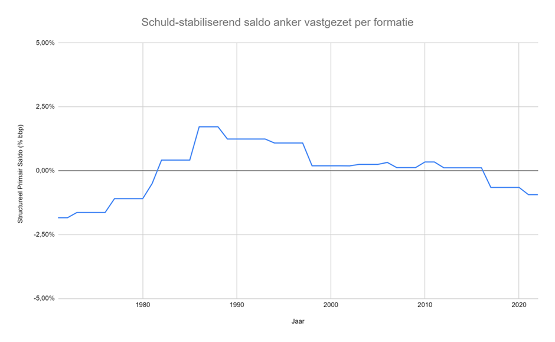
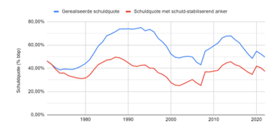
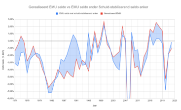

# SBR methodologie:

### Data bronnen:

| Databron | Link |
| --- | --- |
| Output Gap | [AMECO Online - AMECO Online (Current Version 2023-05-15 11:00) | Werkblad - Qlik Sense (europa.eu)](https://dashboard.tech.ec.europa.eu/qs_digit_dashboard_mt/public/sense/app/667e9fba-eea7-4d17-abf0-ef20f6994336/sheet/2f9f3ab7-09e9-4665-92d1-de9ead91fac7/state/analysis) |
| Overheidsuitgaven | [StatLine - Overheidsuitgaven en bestedingen; functies, transacties, overheidssectoren (cbs.nl)](https://opendata.cbs.nl/statline/#/CBS/nl/dataset/84122NED/table?dl=242D5) |
| Potential GDP | [AMECO Online - AMECO Online (Current Version 2023-05-15 11:00) | Werkblad - Qlik Sense (europa.eu)](https://dashboard.tech.ec.europa.eu/qs_digit_dashboard_mt/public/sense/app/667e9fba-eea7-4d17-abf0-ef20f6994336/sheet/2f9f3ab7-09e9-4665-92d1-de9ead91fac7/state/analysis) |
| ECB long inflation expectation | [Inflation forecasts (europa.eu)](https://www.ecb.europa.eu/stats/ecb_surveys/survey_of_professional_forecasters/html/table_hist_hicp.en.html) |
| Rentelasten staatschuld | [Rentelasten blijven historisch laag (cbs.nl)](https://www.cbs.nl/nl-nl/longread/diversen/2020/overheidsfinancien-derde-kwartaal-2020/rentelasten-blijven-historisch-laag) |
| Gemiddelde Rente | CPB |
| Staatschuld + saldi | [StatLine - Saldo en schuld; overheidssectoren (cbs.nl)](https://opendata.cbs.nl/statline/#/CBS/nl/dataset/84118NED/table?ts=1691668347476) |
| Marktrente NLD Staatsschuld | [FRED](https://fred.stlouisfed.org/series/IRLTLT01NLM156N) |

## 1) Rëele uitgaven core domeinen over tijd.

**Doel** : Laten zien hoe de overheidsuitgaven historisch ontwikkelen op enkele core domeinen.

**Databronnen** :

Uitgaven: [StatLine - Overheidsuitgaven en bestedingen; functies, transacties, overheidssectoren (cbs.nl)](https://opendata.cbs.nl/statline/#/CBS/nl/dataset/84122NED/table?dl=242D5)

CPI: [StatLine - Jaarmutatie consumentenprijsindex; vanaf 1963 (cbs.nl)](https://opendata.cbs.nl/#/CBS/nl/dataset/70936ned/table)

**Methode** : De uitgaven komen van CBS en zijn nominaal. Deze uitgaven worden omgezet naar reële euro's aan hand van CPI reeks.

**Verdere onderbouwing** : Door alle nominale uitgaven te corrigeren naar reële uitgaven, kunnen de historische uitgaven met elkaar vergeleken worden.

## 2) Hoe wordt het saldo bijgesteld bij formaties?

**Doel** : Visualiseren hoe vorige formaties hebben bijgestuurd.

**Databronnen** :

Output Gap zoals in [AMECO Online - AMECO Online (Current Version 2023-05-15 11:00) | Werkblad - Qlik Sense (europa.eu)](https://dashboard.tech.ec.europa.eu/qs_digit_dashboard_mt/public/sense/app/667e9fba-eea7-4d17-abf0-ef20f6994336/sheet/2f9f3ab7-09e9-4665-92d1-de9ead91fac7/state/analysis)

Structureel EMU saldo: CPB CEP 2023

**Methode** : Het structureel EMU saldo tijdens de formatie wordt afgezet tegen de output gap. Beide komen direct van de bron.

De verandering van het structureel EMU saldo is de verandering ten opzichte van het saldo zoals tijdens de vorige formatie.

**Verdere onderbouwing** : Het structureel EMU saldo is het conjunctuur geschoonde saldo. De verandering ten opzichte van vorige formatie zegt in welke mate het kabinet bezuinigd /geïnvesteerd tov vorige formatie.

##  3) Wat is het SBR advies op bijstelling geweest?

**Doel** : Laten zien wat het SBR advies op de bijstelling van saldo is geweest. Belangrijk is de opmerking dat er bezuinigen nodig waren voor houdbaarheid, zoals aanpassing AOW.

**Databronnen** :

SBR Advies: Advies ten opzichte van structureel saldo.

Output GAP: [AMECO Online - AMECO Online (Current Version 2023-05-15 11:00) | Werkblad - Qlik Sense (europa.eu)](https://dashboard.tech.ec.europa.eu/qs_digit_dashboard_mt/public/sense/app/667e9fba-eea7-4d17-abf0-ef20f6994336/sheet/2f9f3ab7-09e9-4665-92d1-de9ead91fac7/state/analysis)

**Methode** : Het advies wordt omgezet naar structureel primair saldo en wordt vervolgens vergeleken met de Outputgap.

_SBR Advies_ = Advies ten opzichte van het Structureel primair saldo

Structureel primair saldo = structureel EMU saldo - Rentelasten

Structureel EMU saldo komt van CEP

**Verdere onderbouwing** : Output gap is de proxy voor de conjunctuur. SBR advies ook direct uit de data.

## 4) Structurele veranderingen in de Nederlandse economie

**Doel** : Laten zien dat de structurele groei en rente een fundamenteel beeld geven van de Nederlandse economie. Daarnaast zichtbaar maken dat structurele groei en rente a-cyclisch zijn en minder volatiel bewegen.

**Databronnen** :

Rente: [Rentelasten blijven historisch laag (cbs.nl)](https://www.cbs.nl/nl-nl/longread/diversen/2020/overheidsfinancien-derde-kwartaal-2020/rentelasten-blijven-historisch-laag) Rentelast op staatsschuld

Groei: [AMECO Online - AMECO Online (Current Version 2023-05-15 11:00) | Werkblad - Qlik Sense (europa.eu)](https://dashboard.tech.ec.europa.eu/qs_digit_dashboard_mt/public/sense/app/667e9fba-eea7-4d17-abf0-ef20f6994336/sheet/2f9f3ab7-09e9-4665-92d1-de9ead91fac7/state/analysis)

Inflation expectation: [Inflation forecasts (europa.eu)](https://www.ecb.europa.eu/stats/ecb_surveys/survey_of_professional_forecasters/html/table_hist_hicp.en.html)

Output gap: [AMECO Online - AMECO Online (Current Version 2023-05-15 11:00) | Werkblad - Qlik Sense (europa.eu)](https://dashboard.tech.ec.europa.eu/qs_digit_dashboard_mt/public/sense/app/667e9fba-eea7-4d17-abf0-ef20f6994336/sheet/2f9f3ab7-09e9-4665-92d1-de9ead91fac7/state/analysis)

**Methode** :

_R-G_ = Rentelasten (in % )- (Potential GDP + Inflation Expectation )

Potential GDP zoals van AMECO dataset

Inflation expectation wordt berekend:

- Eerder dan 1999 aan de hand van mediaan van inflatie van de laatste 9 jaar.
- Na 1999, op basis van ECB inflation forecast

Gemiddelde rentelasten op totale staatsschuld.

**Verdere onderbouwing** :

Rente is in nominale rente. Om Potential GDP ook uit te drukken in nominale groei wordt de inflatieverwachting aan % stijging van potential GDP toegevoegd.

## 5) Een implementatie van het schuldstabiliserend anker

**Doel** : Definiëren van een anker dat stuurt op een structureel saldo, waarbij primair saldo wordt bepaald aan de hand van structurele rente en groei verwachting.

**Methode** : Aan de hand van de formule :  .

Gegeven:

- structurele groei verwachting
- rente verwachting
- een schuldquote

Leidt dit tot een structureel primair saldo

## 6) Rekenvoorbeeld:

Methode: Invulling van de formule tot berekening schuld-stabilisernd anker.

## 7) Hoe had dit schuld-stabiliserend anker historisch 

**Doel** : Laten zien hoe het schuld-stabiliserend anker er historisch uit ziet.

**Databronnen** :

Rente: [Rentelasten blijven historisch laag (cbs.nl)](https://www.cbs.nl/nl-nl/longread/diversen/2020/overheidsfinancien-derde-kwartaal-2020/rentelasten-blijven-historisch-laag) Rentelast op staatsschuld

Groei: [AMECO Online - AMECO Online (Current Version 2023-05-15 11:00) | Werkblad - Qlik Sense (europa.eu)](https://dashboard.tech.ec.europa.eu/qs_digit_dashboard_mt/public/sense/app/667e9fba-eea7-4d17-abf0-ef20f6994336/sheet/2f9f3ab7-09e9-4665-92d1-de9ead91fac7/state/analysis)

Inflation expectation: [Inflation forecasts (europa.eu)](https://www.ecb.europa.eu/stats/ecb_surveys/survey_of_professional_forecasters/html/table_hist_hicp.en.html)

Output gap: AMECO

**Methode** :

de implementatie van de Barro formule per formatie: 

_R\_s_ = gemiddelde rentepercentage op de staatsschuld in jaar van formatie

_G\_s_ = GDP potential + inflation expectation

Potential GDP zoals van AMECO dataset

Inflation expectation wordt berekend:

- Eerder dan 1999 aan de hand van mediaan van inflatie van de laatste 9 jaar.
- Na 1999, op basis van ECB inflation forecast

_debt\_quote_:

- Eerste jaar, de reële staatsschuld in het jaar.
- Vervolgjaren: Op basis van de gesimuleerde schuld als anker gekozen was:
  - (schuld van vorig jaar + exogene correcties (privatisering / bailout, etc.) + rentelast in BBP op schuld vorig jaar - Gesimuleerd Saldo ) / Reële BBP

Vervolgens wordt dit saldo gehanteerd voor alle jaren tussen de formaties.

**Verdere onderbouwing** :

Sturen op schuld-stabiliserend saldo per formatie: Het idee is dat als een kabinet op het schuld-stabiliserend saldo stuurt, dit op lang termijn een financiële gezondheid waarborgt.

Per formatie wordt gekeken naar de huidige staatsschuld, en er wordt gepoogd dit stabiel te houden. Het bijbehorende saldo hangt af van de rente- en groeiverwachting. Er wordt in deze berekening niet gestuurd op een vast staatsschuldquote (e.g. 60%).

Voor de renteverwachting wordt het gemiddelde rentepercentage op staatsschuld in dat jaar genomen. Omdat de staatsschuld langzaam wordt geherfinancierd, beweegt dit langzaam naar de nieuwe marktrente toe. Voor de groeiverwachting wordt het potentiële BBP genomen, zoals geschat door de EC (AMECO). Hierbij wordt de inflatieverwachting in dat jaar aan toegevoegd, om beide verwachtingen nominaal te maken.

## 8) Verloop van staatsschuld onder het schuld-stabiliserende anker 

**Doel** : Laten zien hoe de staatsschuld ontwikkeld was onder het schuld-stabiliserende anker. Dit houdt rekening met dezelfde schokken, maar neemt aan dat politiek niet anders had gehandeld.

**Databronnen** :

Staatsschuld: CBS: [StatLine - Saldo en schuld; overheidssectoren (cbs.nl)](https://opendata.cbs.nl/statline/#/CBS/nl/dataset/84118NED/table?ts=1691668347476)

Endogeniteit Correctie: 0.6 van ECB

**Methode** :

_Gerealiseerde staatsschuld:_ direct vanuit CPB bron

Staatsschuld onder anker: Berekend zoals beschreven in vorige slide, maar met een andere groeiterm:

_debt\_quote_:

- Eerste jaar, de reële staatsschuld in het jaar.
- Vervolgjaren: Op basis van de gesimuleerde schuld als anker gekozen was:
  - (schuld van vorig jaar + exogene correcties (privatisering / bailout, etc.) + rentelast in BBP op schuld vorig jaar - Gesimuleerd Saldo ) / Groei BBP met Endogeniteitscorrectie

Groei endogeniteit correctie (GEC) wordt berekend aan hand van :

_GEC_ = Reële groei - (gesimuleerde primaire saldo - reële primaire saldo) \* 0.6

Deze GEC wordt gebruikt om de gesimuleerde debt\_quote te corrigeren.

**Verdere onderbouwing** :

De onderbouwing van het gebruik van de GEC-term is omdat:

- Indien er minder hard bezuinigd had mogen worden (en er dus een negatiever gesimuleerd primair saldo werd gedraaid ) was er minder groei verloren gegaan en ligt de gesimuleerde groei hoger dan de reële groei.
- Op dezelfde manier, indien er minder geïnvesteerd was onder het anker ( en er een minder negatief saldo werd gedraaid), dan heeft dit ook invloed op de reële groei, en ligt de gesimuleerde groei lager dan de reële groei.

## 9) Het EMU saldo als het anker was gebruikt ten opzichte van het echte EMU saldo.

**Doel** : Zichtbaar maken dat de EMU saldi onder anker niet sterk variërend is tov echt EMU saldi.

**Databronnen** :

Gerealiseerde EMU saldi: [StatLine - Saldo en schuld; overheidssectoren (cbs.nl)](https://opendata.cbs.nl/statline/#/CBS/nl/dataset/84118NED/table?ts=1691668347476)

Gesimuleerd EMU saldi: zelf berekend

**Methode** :

_EMU Saldo_: Primair saldo - gemiddelde rente \* staatsschuld - exogene correcties (privatisering/bailout etc).

_Gesimuleerd EMU saldo =_ gesimuleerd primair saldo- gemiddelde rente \* gesimuleerde staatsschuld - exogene correcties (privatisering/bailout etc).

_Gesimuleerd primair saldo =_ gesimuleerd saldo van anker + saldo door conjunctuur

Gesimuleerde _staatsschuld_ = Zoals berekend in vorige slide (6)

